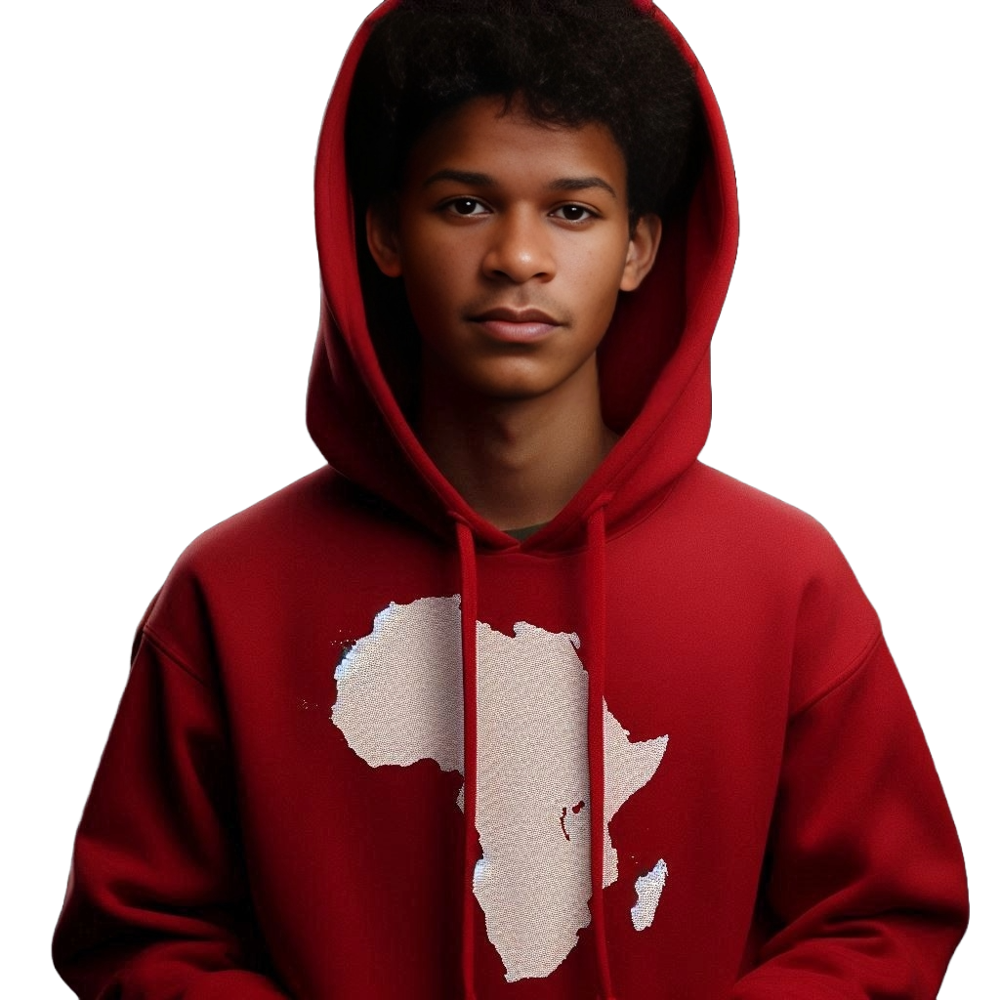

# 👋 Olá, Eu sou Adilson Muffins!

### 🚀 Dev Android | Web | Designer Gráfico | Designer UX/UI

Sou desenvolvedor e designer, comprometido em criar soluções inovadoras e visuais marcantes. Sempre pronto para enfrentar novos desafios, busco agregar valor a projetos que realmente fazem a diferença.

<h3 align="left">Linguagens & Ferramentas</h3>

  
  
  
  
  
  
  
  
  
  

---

## 🛠️ Minhas Habilidades

- **Desenvolvimento Android**: Especialista em Sketchware, Java e Kotlin.
- **Desenvolvimento Web**: HTML, CSS, JavaScript, e integração com Firebase.
- **Design Gráfico & UX/UI**: Criação de interfaces intuitivas e visuais cativantes com Adobe XD.
- **Automação e Integração**: Uso de ferramentas como Kommo para integrar sistemas com WhatsApp.

---

## 📈 Projetos Destacados

- **Muffins Store**: Uma loja online inovadora para acessórios e muito mais. [Visite o site](https://muffinsstore-mz.web.app)
- **Muffins TV**: é uma plataforma de streaming em desenvolvimento, site ainda está em construção e estará disponível em breve. [Visite o site](https://www.muffinstv.wuaze.com)
- **Identidades Visuais**: Desenvolvimento de marcas e identidades visuais para freelancers e empresas. [Visite o site](https://muffinsstore-mz.web.app)

---

## 📫 Contato

  
  
  
  
<a href="https://adilson-muffins.web.app/" title="Portfolio" target="_blank">
  

---
